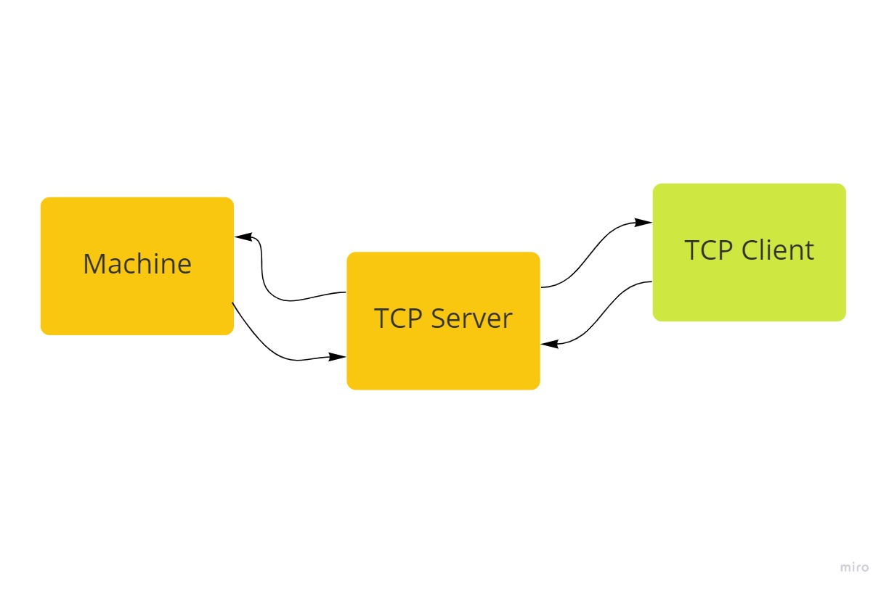

# TCP

- comunicar uma ui com um servidor atraves de uma conexao tcp
- deve ser capas de executar os comandos **help, list, toogle e turn**, para mutar o estado das maquinas



## server

```ts

const server = createServer((socket) => {
    socket.on("data", (data) => {
        const msg = data.toString()
        console.log(msg)

        try{
            socket.write(exec(msg))
        }
        catch(erro){
            const err = erro as Error
            socket.write(err.message)
        }
        try {
            sockets.list.filter(_socket => {
                return socket !== _socket
            })
            .forEach((_socket, index, arr) => {
                _socket.write(data)
                _socket.resume()
            })
        } catch (error) {
            
        }
    })

    const close = () => {
        sockets.list = sockets.list.filter(_soket => socket !== _soket)
        socket.destroy()
    }

    ["close", "end", "error"].forEach(
        oper => {
            socket.on(oper, close)
        }
    )

    socket.pipe(socket)
    sockets.list = [...sockets.list, socket]
})

```

## client

```ts
const client = new Socket();
client.connect(1337, `127.0.0.1`);

app.on('ready', async () => {
  await prepareNext('./renderer')
  
  
  
  const mainWindow = new BrowserWindow({
    width: 800,
    height: 600,
    webPreferences: {
      nodeIntegration: false,
      contextIsolation: false,
      preload: join(__dirname, 'preload.js'),
    },
  })
  
  const url = isDev
  ? 'http://localhost:8000/'
  : format({
    pathname: join(__dirname, '../renderer/out/index.html'),
    protocol: 'file:',
    slashes: true,
  })
  
  mainWindow.loadURL(url)
})

// Quit the app once all windows are closed
app.on('window-all-closed', app.quit)

const dataArray:string[] = []

// cliente
client.on("data", data => {
  dataArray.push(data.toString())
})

ipcMain.on('clear', (event: IpcMainEvent) => {
  dataArray.splice(0, dataArray.length)
  event.sender.send('message', JSON.stringify(dataArray));
})

ipcMain.on('read', (event: IpcMainEvent) => {
  event.sender.send('message', JSON.stringify(dataArray));
})
// listen the channel `message` and resend the received message to the renderer process
ipcMain.on('message', ((event: IpcMainEvent, message: any) => {
  console.log(message)
  client.write(message)
  event.sender.send("read")
}))
```

## github

- [server](https://github.com/nicolaskruger/tcp-server)
- [client](https://github.com/nicolaskruger/tcp-app)